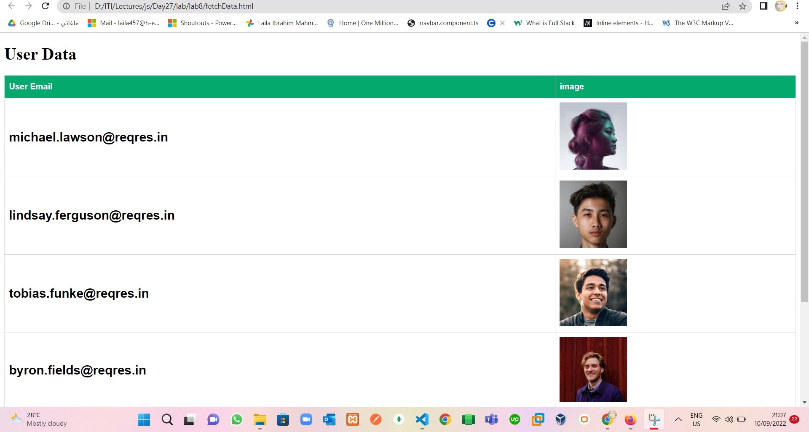
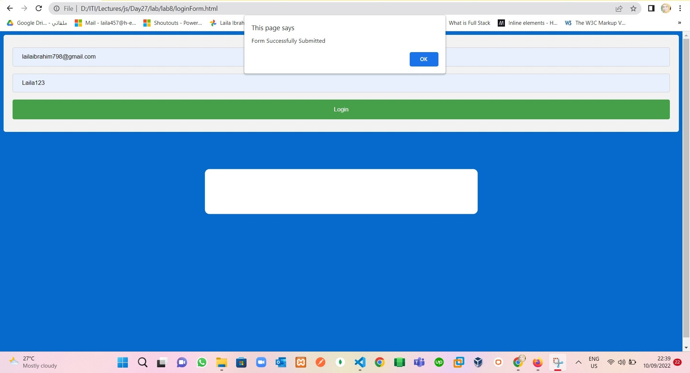

# First Part
## Ajax Lab
> Display users data (image, email) in html page, 
 you should fetch the data from this 
 url [link](https://reqres.in/api/users?page=2)
 the data should be fetched on page load 
## Solve 1 in 

# Second Part 
as in image  

## Solve 2 
> Modify validation on your form and add regex to validation
> 1. if email and password empty 
  

  2. if empty password
  
  
  3. if empty email
  

  4. if password doesn't match regular expression
  

  5. if form submitted
  

## Third Part
 update your todolist to save the tasks to local storage 
 as in image 

## Solve 3
> 1. before add to LocalStorage
 

 2. after add 2 tasks to local storage
 

